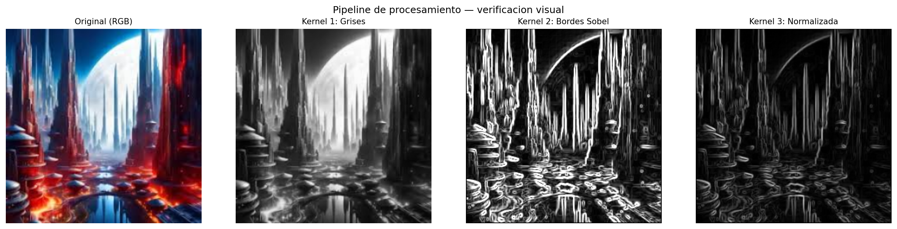

# Proyecto Final — Pipeline de Procesamiento de Imagenes en GPU

Materia: Programacion avanzada en GPU

## Integrantes

- Aarian Jeilyn Arredondo Sanchez
- Carlos Javier Romo Jr.

---

## Descripcion general

Este proyecto implementa un pipeline de procesamiento de imagenes completamente
en GPU usando CUDA C/C++. El sistema recibe un batch de 8 imagenes RGB y aplica
una secuencia de 4 kernels en GPU sin bajar los datos a CPU entre pasos.

---

## Estructura del pipeline

```text
Batch de imagenes RGB  (4D: B x 3 x H x W)
           |
           v
  Kernel 1 — Escala de grises     (4D → 3D: B x H x W)
           |
           v
  Kernel 2 — Deteccion de bordes  (3D → 3D: B x H x W)
           |
           v
  Kernel 3 — Normalizacion        (3D → 3D: B x H x W)
           |
           v
  Kernel 4 — RMSE vs referencia   (3D → 1D: B valores)
           |
           v
  Vector de RMSE por imagen       (1D: B valores)
```

---

## Descripcion de cada kernel

**Kernel 1 — Escala de grises** (`grises.cu`)
Convierte cada imagen RGB del batch a escala de grises usando la formula
estandar de luminancia: `Gris = 0.2989*R + 0.5870*G + 0.1140*B`.
Grid 2D de bloques 16x16. Un loop interno recorre el batch completo.
Entrada: tensor 4D (B, 3, H, W). Salida: tensor 3D (B, H, W).

**Kernel 2 — Deteccion de bordes Sobel** (`bordes.cu`)
Aplica el filtro Sobel en X y en Y sobre cada imagen en escala de grises,
calcula la magnitud del gradiente `sqrt(Gx^2 + Gy^2)` y deja en 0 los
pixeles del borde exterior de la imagen.
Grid 2D de bloques 16x16. Un loop interno recorre el batch.
Entrada: tensor 3D (B, H, W). Salida: tensor 3D (B, H, W).

**Kernel 3 — Normalizacion** (`normalizar.cu`)
Implementado en dos pasos que se ejecutan consecutivamente en GPU:
- Paso A (`reducir_max`): reduccion en shared memory para encontrar el
  valor maximo de cada imagen del batch.
- Paso B (`normalizar`): divide cada pixel entre el maximo de su imagen,
  escalando el rango a [0, 1]. Usa grid 3D (gridX, gridY, B) con
  `blockIdx.z` para indexar la imagen dentro del batch.
Entrada: tensor 3D (B, H, W). Salida: tensor 3D (B, H, W).

**Kernel 4 — RMSE** (`mse.cu`)
Calcula el error cuadratico medio entre cada imagen normalizada y la
primera imagen del batch (usada como referencia). Implementado en dos pasos:
- Paso A (GPU): reduccion en shared memory que acumula sumas parciales
  de diferencias al cuadrado por bloque, para cada imagen del batch.
- Paso B (CPU): suma los bloques de cada imagen, divide entre H*W y
  aplica la raiz cuadrada para obtener el RMSE final.
Entrada: tensor 3D (B, H, W) + referencia 2D (H, W). Salida: vector 1D (B).

---

## Justificacion del tamano de bloque

Todos los kernels 2D usan `dim3 bloque(16, 16)` = 256 threads por bloque.
Esta eleccion se justifica por tres razones:

1. **Multiplo de 32**: 256 = 8 x 32, por lo que caben exactamente 8 warps
   completos por bloque. Ningun thread queda en un warp parcial y no hay
   divergencia por padding.

2. **Ocupacion del SM**: la GPU T4 de Colab tiene un limite de 1024 threads
   por bloque y 32 bloques por SM. Con 256 threads se pueden alojar hasta
   4 bloques por SM simultaneamente, lo que mantiene la ocupacion alta sin
   presionar el banco de registros.

3. **Acceso a memoria coalescente**: con bloque 16x16, los 16 threads de
   una misma fila acceden a 16 posiciones contiguas en memoria (row-major),
   formando transacciones de 64 bytes alineadas a la cache L2 de la GPU.

Los kernels 1D (`reducir_max` y `calcular_rmse`) usan 256 threads por bloque
por la misma razon: 256 = potencia de 2, lo que permite que la reduccion
en arbol funcione sin casos especiales, y es multiplo de 32.

---

## Compilacion y ejecucion

El proyecto se ejecuta en Google Colab con GPU habilitada.
Abrir el notebook `colab.ipynb` y correr las celdas en orden:

1. Subir el archivo `proyecto_gpu.zip` con toda la carpeta del proyecto
2. El notebook descomprime el zip y descarga automaticamente los headers
   `stb_image.h` y `stb_image_write.h` desde el repositorio oficial de stb
3. Compila con:

```bash
nvcc -O2 -o pipeline \
    main.cu \
    kernels/grises.cu \
    kernels/bordes.cu \
    kernels/normalizar.cu \
    kernels/mse.cu \
    utils/imagen.cu \
    utils/timer.cu \
    -I utils \
    -lm
```

4. Ejecuta el pipeline con `./pipeline`
5. Al terminar descarga automaticamente `resultados_pipeline.zip` con
   las imagenes generadas y el archivo `rmse_por_imagen.txt`

El programa espera las imagenes en `imagenes/img0.png` hasta `imagenes/img7.png`.
Todas deben tener las mismas dimensiones (minimo 256x256).

---

## Imagenes de resultado



---

## Tiempos medidos en GPU (Colab — GPU: T4)

| Etapa                | Tiempo (ms) |
|----------------------|-------------|
| Transferencia H→D    | 1.519 ms    |
| Kernel grises        | 0.252 ms    |
| Kernel Sobel         | 0.152 ms    |
| Kernel normalizacion | 0.248 ms    |
| Kernel RMSE          | 0.191 ms    |
| Transferencia D→H    | 4.756 ms    |
| Pipeline total       | 7.202 ms    |
| CPU equivalente      | 7.465 ms    |
| Speedup              | 1.04x       |

---

## Analisis del costo de transferencias H↔D

El pipeline realiza exactamente dos transferencias entre CPU y GPU:

- **H→D al inicio**: sube el batch completo RGB de tamaño
  `B x 3 x H x W x 4 bytes`. Para 8 imagenes de 256x256:
  `8 x 3 x 256 x 256 x 4 = 6.29 MB`.

- **D→H al final**: baja tres buffers de grises/bordes/normalizada:
  `3 x B x H x W x 4 bytes = 3 x 8 x 256 x 256 x 4 = 18.87 MB`.

Entre los kernels K1, K2, K3 y K4 los datos nunca tocan el bus PCIe.
En nuestras mediciones, la transferencia D→H (4.756 ms) es el paso mas
costoso del pipeline y representa el 66% del tiempo total (7.202 ms).
Esto es esperado con un batch pequeno de 8 imagenes: el overhead del bus
PCIe domina sobre el computo real. La ventaja de mantener los datos en
VRAM se vuelve mas notable conforme crece el batch, porque el costo de
transferencia es fijo mientras que el computo escala con B.

---

## Valores de RMSE por imagen

Imagen 0 RMSE: 0.000000
Imagen 1 RMSE: 0.182725
Imagen 2 RMSE: 0.182864
Imagen 3 RMSE: 0.175814
Imagen 4 RMSE: 0.210755
Imagen 5 RMSE: 0.174650
Imagen 6 RMSE: 0.186073
Imagen 7 RMSE: 0.185878

---

## Comparacion con implementacion CPU

La implementacion CPU equivalente aplica los mismos 4 pasos con loops
en C puro. El tiempo se mide con `clock()` y el speedup se calcula como:

Speedup = tiempo_CPU_ms / tiempo_pipeline_GPU_ms

Con 8 imagenes de 256x256 el speedup es de **1.04x**. La GPU apenas
supera a la CPU en este caso porque las transferencias H→D y D→H
dominan el tiempo total. Los 4 kernels juntos tardan menos de 1 ms,
pero mover los datos al inicio y al final cuesta mas de 6 ms en total.

Con un batch mas grande el speedup mejora porque el computo en GPU
escala con B mientras que el overhead de lanzar los kernels es fijo.
Con 64 imagenes o mas el computo paralelo empieza a pesar mas que
las transferencias y el speedup sube de forma mas notoria.